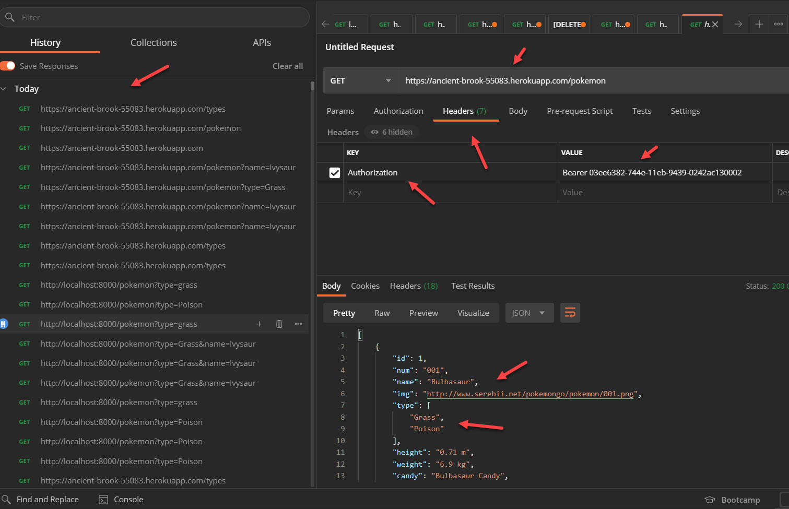

## >> App Name:

Pokedex-API--Express-Server-Heroku-drill

## >> APP/Project Summary:

This project builds an Express Server with a secured API endpoint so that it can be safely opened to the public. It is deployed publicly via Heroku.

The APP allows the user to query from a set of data with pokemon characters names like Ivysaur,Charizard, etc, and its’ unique charatcist/'type'.

Note that the remote endpoint
```
https://ancient-brook-55083.herokuapp.com/pokemon
```
only responds when given a valid Authorization header with a Bearer API key token as followed :
```  
Key: Authorization
Value : Bearer 03ee6382-744e-11eb-9439-0242ac130002
``` 
## >> Query String Parameters
- Name - a string parameter used for searching a pokemon character with its name(example name=Ivysaur)

- types - return a valid list of pokemon character’s speciality /'type' recognized  by this app(partial list Fighting, Fire, Flying, etc ...)

- type - a string parameter used for searching for a pokemon character's speciality/'type'.

## >> Sample Endpoints
``` 
https://ancient-brook-55083.herokuapp.com/pokemon
https://ancient-brook-55083.herokuapp.com/pokemon?types
https://ancient-brook-55083.herokuapp.com/pokemon?type=Grass
https://ancient-brook-55083.herokuapp.com/pokemon?type=Grass&name=Ivysaur
https://ancient-brook-55083.herokuapp.com/pokemon?name=Ivysaur
https://ancient-brook-55083.herokuapp.com/pokemon?name=Venusaur
``` 

## >> Screenshots

API query via Heroku with an Authorization header



## >> Technologies used in this APP:

* Express Server
* Heroku
* Git remotes
* app.get API
* Express middleware
* API tokens
* Authorization headers
* NODE_ENV
* CORS
* Helmet

-> Javascript: ES6

-> Tools
* Postman
* VSC Debugger
* nodemon 
* NPM
* morgan logging tool


## >> [Github Link](https://github.com/davetam88/Pokedex-API--Express-Server-Heroku-drill)
